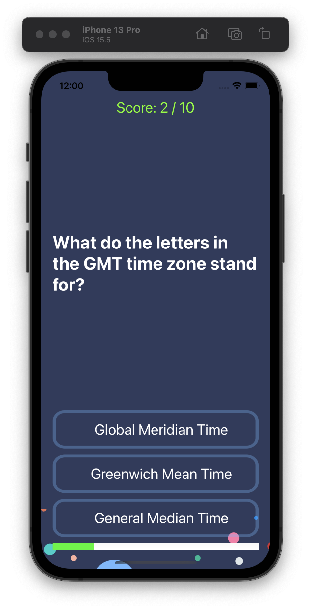

#  MultiQuizzler

## Our Goal

We've been introduced to a mobile design pattern: the Model View Controller (MVC) pattern. A design pattern is simply a repeatable and optimized solution to a common software problem.

## What did I create

I created a trivia quiz app with multiple choices.

## What did I learn

* How to programmatically change UI elements such as Labels and Buttons.
* What is a design pattern and how is it used in programming.
* How to use the Model-View-Controller or MVC pattern for app development.
* Learn about Swift Structures how to instantiate a struct instance.
* Understand the difference between value types and reference types. 
* Learn about Swift Classes and creating Objects.
* Compare Swift Classes with Swift Structs and know when to use which.
* Learn about Object Oriented Programming.
* How to refactor code and stay organised.

## Multiple Choice Quiz

```
 Question(q: "Which is the largest organ in the human body?", a: ["Heart", "Skin", "Large Intestine"], correctAnswer: "Skin"),
        Question(q: "Five dollars is worth how many nickels?", a: ["25", "50", "100"], correctAnswer: "100"),
        Question(q: "What do the letters in the GMT time zone stand for?", a: ["Global Meridian Time", "Greenwich Mean Time", "General Median Time"], correctAnswer: "Greenwich Mean Time"),
        Question(q: "What is the French word for 'hat'?", a: ["Chapeau", "Écharpe", "Bonnet"], correctAnswer: "Chapeau"),
        Question(q: "In past times, what would a gentleman keep in his fob pocket?", a: ["Notebook", "Handkerchief", "Watch"], correctAnswer: "Watch"),
        Question(q: "How would one say goodbye in Spanish?", a: ["Au Revoir", "Adiós", "Salir"], correctAnswer: "Adiós"),
        Question(q: "Which of these colours is NOT featured in the logo for Google?", a: ["Green", "Orange", "Blue"], correctAnswer: "Orange"),
        Question(q: "What alcoholic drink is made from molasses?", a: ["Rum", "Whisky", "Gin"], correctAnswer: "Rum"),
        Question(q: "What type of animal was Harambe?", a: ["Panda", "Gorilla", "Crocodile"], correctAnswer: "Gorilla"),
        Question(q: "Where is Tasmania located?", a: ["Indonesia", "Australia", "Scotland"], correctAnswer: "Australia")
```        


